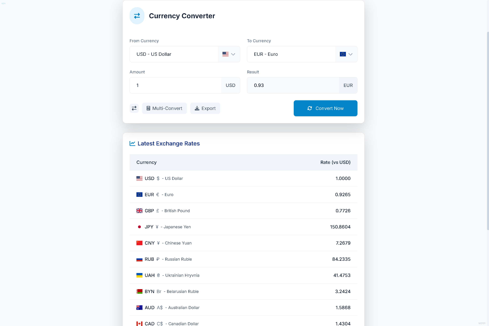

# Currency Converter



A modern, responsive currency converter application with real-time exchange rates, multiple currency support, and banking-style design.

## Features

- **Real-time Exchange Rates**: Fetch the latest currency exchange rates from Open Exchange Rates API
- **Multiple Currency Support**: Convert between major world currencies including USD, EUR, GBP, JPY, CAD, AUD, CHF, CNY, RUB, UAH, BYN
- **Offline Mode**: Continue using the app even when offline with cached exchange rates
- **Multi-Currency Conversion**: Convert a single amount to multiple currencies simultaneously
- **Export Results**: Export your conversion results to CSV format
- **Interactive UI**: Modern banking-style design with responsive layout for all devices
- **Flag Icons**: Visual identification of currencies with their respective country flags
- **Easter Eggs**: Hidden features for curious users to discover!

## Technologies Used

### Frontend
- **HTML5**: Semantic structure
- **CSS3**: Custom styling with responsive design
- **JavaScript**: ES6+ for dynamic functionality
- **Tailwind CSS**: Utility-first CSS framework for rapid UI development
- **Bootstrap**: Additional UI components
- **Font Awesome**: Icon toolkit
- **Flag Icons**: Country flag representation for currencies

### Backend
- **Node.js**: Server-side JavaScript runtime
- **Express**: Web application framework
- **Axios**: Promise-based HTTP client for API requests
- **Dotenv**: Environment variable management for secure configuration

### APIs
- **Open Exchange Rates API**: Real-time currency exchange rate data

## How to Run the Project

### Prerequisites
- Node.js (v14.x or higher)
- npm (v6.x or higher)

### Installation Steps

1. **Clone the repository**
   ```bash
   git clone https://github.com/yourusername/Currency-Converter.git
   cd Currency-Converter
   ```

2. **Install dependencies**
   ```bash
   npm install
   ```

3. **Environment Setup**
   - Create a `.env` file in the project root
   - Add your Open Exchange Rates API key:
     ```
     API_KEY=your_api_key_here
     PORT=3000
     ```

4. **Start the server**
   ```bash
   npm run dev
   ```

5. **Access the application**
   - Open your browser and navigate to `http://localhost:3000`

## Project Structure

```
Currency-Converter/
├── public/               # Static files
│   ├── css/              # Stylesheets
│   ├── js/               # Client-side JavaScript
│   ├── index.html        # Main HTML file
├── src/                  # Server-side code
│   ├── server.js         # Express server setup
├── .env                  # Environment variables (create this)
├── package.json          # Project dependencies
└── README.md             # Project documentation
```

## Supported Currencies

The application supports the following major world currencies:
- USD (US Dollar)
- EUR (Euro)
- GBP (British Pound)
- JPY (Japanese Yen)
- CAD (Canadian Dollar)
- AUD (Australian Dollar)
- CHF (Swiss Franc)
- CNY (Chinese Yuan)
- RUB (Russian Ruble)
- UAH (Ukrainian Hryvnia)
- BYN (Belarusian Ruble)

## Finding Easter Eggs

There are several hidden Easter eggs in the application:

1. **Konami Code**: Press the key sequence ↑ ↑ ↓ ↓ M A K S to trigger a special animation
2. **Console Command**: Open your browser's console and type `Maks0101aps()` to see a special message
3. **Hidden Text**: Look carefully at the corners of the application

## Development Commands

- **Start development server**: `npm run dev`
- **Start production server**: `npm start`

## Browser Compatibility

- Chrome (latest)
- Firefox (latest)
- Safari (latest)
- Edge (latest)

## License

© 2025 Maks0101aps. All rights reserved.

## Contributing

Contributions, issues, and feature requests are welcome! Feel free to check the [issues page](https://github.com/yourusername/Currency-Converter/issues).

## Author

- GitHub: [@Maks0101aps](https://github.com/Maks0101aps)